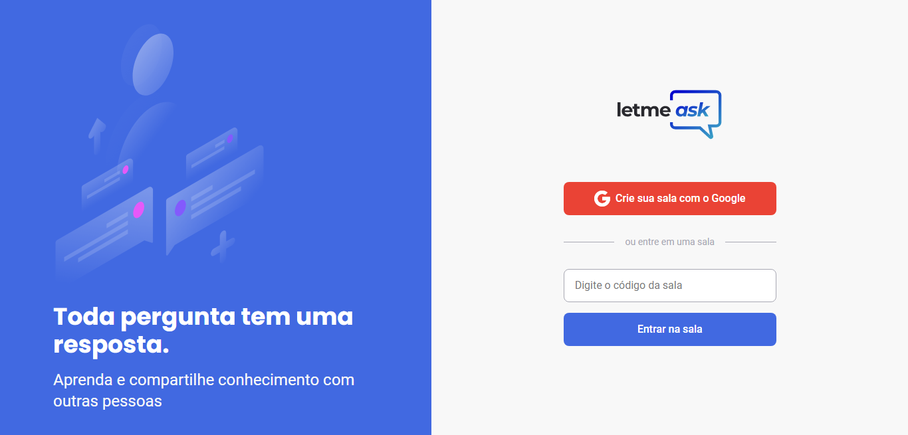

<div align="center">
  
</div>

<br>

<p align="center">
  
</p>

## :hammer_and_pick: Technologies

This project was developed using the following technologies:

- React
- Firebase
- TypeScript

## Preview
[](https://letmeask-nlw-06-together.web.app/)

## 🚀 Getting started

### Requirements

**Clone the project and access the folder**

```bash
$ git clone https://github.com/camiladcm/letmeask-nlw06-together.git && cd letmeask-nlw06-together
```

**Follow the steps below**

```bash
# Install the dependencies
$ yarn

# Start the project
$ yarn start
```

The app will be available for access on your browser at http://localhost:3000

## 💻 Project

Letmeask is a perfect for content creators to create Q&A rooms with their audience. 

This project was developed during the Next Level Week Together, presented by Rocketseat.  

## 📝 License

This project is licensed under the MIT License. See the [LICENSE](LICENSE.md) file for details.

---

<p align="center">Made with ❤️ by Camila Marçal<p>
